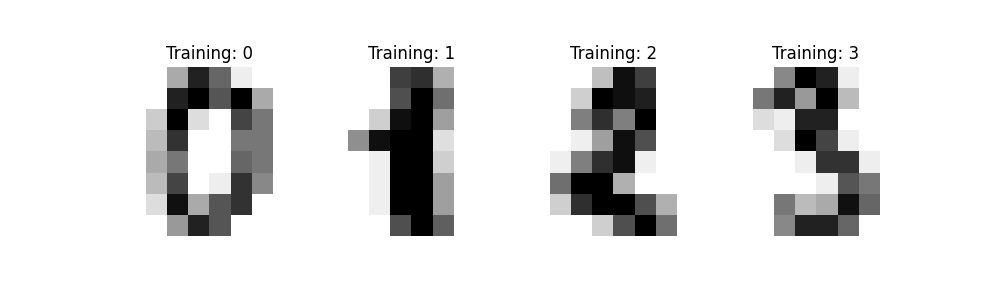
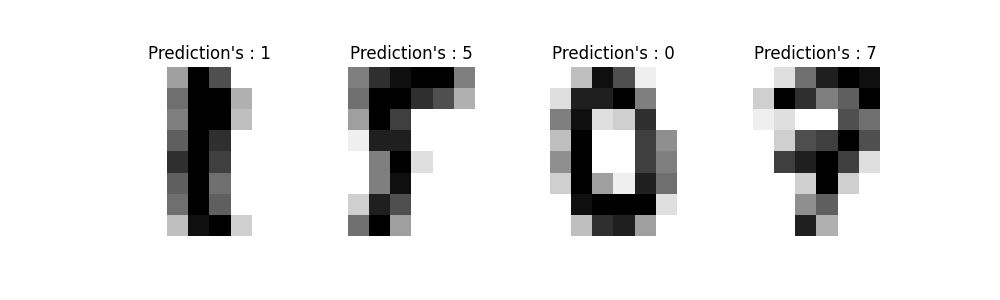
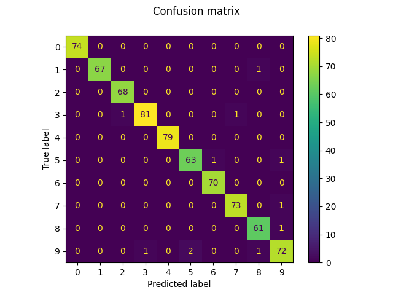

 <h1>Hand written numbers recognizer using SVM</h1>
 <h2>Requirements</h2> 
 - python     
 - pip
 - scikit learn
 - matplotlib
 <h2>Abstract</h2>
 <h5>Recognising hand written numbers using the SVM model and SVC classifier</h5>
 <h2>Training Dataset</h2>
 <h5>
 The Digits dataset from sklearn consists of 8x8 array pixel images of the hand-written digits. The images attribute of the dataset stores 8x8 arrays of grayscale values for each image to make processing of images easier as RGB will have more data to process and unncessary information.

 
 
 The target attribute of the dataset stores the digit each image represents and this is included in the title on top of the 4 plots given.

 The data has been split into training data and testing data with ``` shuffle = True``` and ``` random_state = 1 ``` as the parameters.
 </h5>
 <h2>Classification method</h2>
 <h5>To apply a classifier on this data, we need to flatten the images ie; make them easier to interpret, turning each 2-D array of grayscale values from shape (8, 8) into shape (64,0). Subsequently, the entire dataset will be of shape (samples,features), where samples is the number of images and features is the total number of pixels in the image.
 </h5>
 <h2>Predicted values</h2>
 <h5>

 
 
 </h5>
 <h2>Result</h2>
 <h5>
 Achieved 98% accuracy with random data from dataset.

 ```
 Classification report for SVC(gamma=0.001):
              precision    recall  f1-score   support

           0       1.00      1.00      1.00        74
           1       1.00      0.99      0.99        68
           2       0.99      1.00      0.99        68
           3       0.99      0.98      0.98        83
           4       1.00      1.00      1.00        79
           5       0.97      0.97      0.97        65
           6       0.99      1.00      0.99        70
           7       0.99      0.99      0.99        74
           8       0.97      0.98      0.98        62
           9       0.96      0.95      0.95        76

    accuracy                           0.98       719
   macro avg       0.98      0.98      0.98       719
 weighted avg       0.98      0.98      0.98       719

 ```
 Formed Confusion Matrix from the predictions to perform analysis.

 ```
 Confusion matrix: 
[[74  0  0  0  0  0  0  0  0  0]
 [ 0 67  0  0  0  0  0  0  1  0]
 [ 0  0 68  0  0  0  0  0  0  0]
 [ 0  0  1 81  0  0  0  1  0  0]
 [ 0  0  0  0 79  0  0  0  0  0]
 [ 0  0  0  0  0 63  1  0  0  1]
 [ 0  0  0  0  0  0 70  0  0  0]
 [ 0  0  0  0  0  0  0 73  0  1]
 [ 0  0  0  0  0  0  0  0 61  1]
 [ 0  0  0  1  0  2  0  0  1 72]]

 ```
 Confusion Matrix heatmap:

 
 </h5>
 
